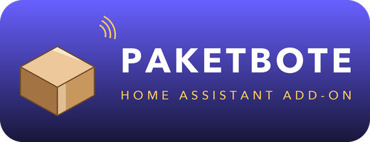

# Paketbote



Amazon-Lieferverfolgung für Home Assistant über einen dauerhaft eingeloggten,
bedienbaren Browser — Live-Zustellstatus, Zustellfenster und „noch X Stopps
entfernt" als Entities, per MQTT Discovery.

[](https://my.home-assistant.io/redirect/supervisor_add_addon_repository/?repository_url=https%3A%2F%2Fgithub.com%2FBobMcGlobus%2Fha-paketbote)

## Installation

Auf den Button oben klicken — oder manuell unter **Einstellungen → Add-ons →
Add-on Store → ⋮ → Repositories** diese URL hinzufügen:

```
https://github.com/BobMcGlobus/ha-paketbote
```

Danach erscheint **Paketbote** im Add-on Store. Installieren, starten, fertig.

## Add-ons

| Add-on | Beschreibung |
|---|---|
| [Paketbote](paketbote) | Amazon-Lieferverfolgung via persistentem Browser |

## Warum ein Add-on

Amazon bietet keine öffentliche API für Bestell- oder Lieferdaten. Die einzige
Quelle für Live-Zustelldaten — „noch X Stopps entfernt", aktives Zustellfenster
— ist der eingeloggte Progress-Tracker auf `amazon.de`.

Das Add-on betreibt dafür einen echten, headful laufenden Chrome und liest die
Tracking-Seiten aus. Verlangt Amazon Login, MFA oder ein Captcha, lässt sich das
direkt im Panel erledigen — über HA-Ingress authentifiziert, auch aus der
Companion App heraus. Kein VNC-Port, kein Reverse-Proxy-Eintrag, kein SSH.

```
Xvfb :99  ──▶  Openbox  ──▶  Google Chrome (headful, CDP :9222)
   │
   └──▶  x11vnc :5900  ──▶  noVNC :6081  ──▶  nginx :6080  ──▶  Ingress
```

Chrome läuft als eigener, langlebiger Prozess — nicht von Playwright gestartet.
Der Scraper hängt sich per CDP an. Dadurch überlebt die Amazon-Session jeden
Scraper-Neustart und jeden Crash. Das Profil liegt auf dem
Add-on-Config-Volume und übersteht Neustarts und Updates.

## Stand

Das Projekt wird in Phasen gebaut; jede endet mit einem lauffähigen Zustand.

| Phase | Inhalt | Status |
|---|---|---|
| 0 | Vorbedingungen (HA OS, amd64, Supervisor) | ✅ |
| 1 | Add-on-Skelett + bedienbarer Browser | ✅ |
| 2 | Scraper-Kern (Playwright über CDP) | ✅ |
| 3 | Extraktion: CSS zuerst, LLM als Fallback | ✅ |
| 4 | Scheduler / Polling-Zustandsmaschine | ✅ |
| 5 | MQTT Discovery | ✅ |
| 6 | Härtung (Backoff, Request-Cap, Gesundheitssensor) | teilweise |
| 7 | DHL über die offizielle API | offen |

**Aktuell nutzbar:** Entities in Home Assistant. Der Browser im Panel bleibt
für Login, MFA und Captcha zuständig.

## Voraussetzungen

- Home Assistant OS oder Supervised (ein reiner Docker-Container kann keine
  Add-ons installieren)
- amd64
- MQTT-Broker in HA — das Mosquitto-Add-on genügt

## Hinweis

Im Panel sitzt ein voll funktionsfähiger, bei Amazon eingeloggter Browser.
**1-Click-Bestellung im Amazon-Konto deaktivieren**, bevor das produktiv läuft.
Das Chrome-Profil enthält Session- und Device-Trust-Cookies und gehört nicht in
einen Klartext-Backup-Sync.

## Lizenz

MIT — siehe [LICENSE](LICENSE).
